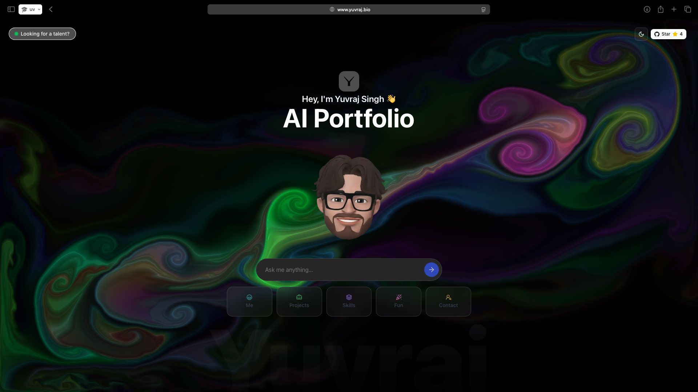

<div align="center">

  <br />
  <p>
    <a href="#"></a>
  </p>
  <br />

  <h1>🌐 Santosh Reddy - DevOps Engineer Portfolio 🤖✨</h1>
</div>

---

### **Badges**

<p align="center">
  
  
  <a href="https://nextjs.org/"></a>
  <a href="https://vercel.com/"></a>
  <a href="https://mistral.ai/"></a>
  <a href="https://github.com/santoshreddy/devops-portfolio/stargazers"></a>
  <a href="https://github.com/santoshreddy/devops-portfolio/graphs/contributors"></a>
</p>

---

### **About The Project** 💡

Static portfolios are a thing of the past. They present a one-sided, lifeless view of a developer's journey. I decided to build an **AI-powered, interactive portfolio** that transforms the traditional portfolio into a dynamic, engaging experience. Instead of forcing recruiters and potential collaborators to scroll endlessly through information, it invites them to ask questions and receive answers tailored specifically to them.  

This is a portfolio that doesn't just show—it communicates.

---

### **Features** ✨

*   **🤖 Interactive AI Assistant:** Engage in real-time conversation with my AI persona. Ask anything about my DevOps experience, skills, projects, or DevOps best practices and get instant, context-aware answers.
*   **🧠 Context-Aware Engine:** The AI's personality and responses adapt based on who it's talking to—whether you're a recruiter, a fellow DevOps engineer, or someone curious about infrastructure.
*   **🎨 Multi-Section Layout:** A sleek, modern interface with multiple sections for different aspects of my professional life.
*   **💬 Floating Chat Widget:** Always accessible chat assistant without taking over the entire page.
*   **🚀 Built for Everyone:** Crafted to provide a unique experience for tech recruiters, potential collaborators, and curious friends alike.

---

### **Tech Stack** 🛠️

| **Category**      | **Technology**                                                                                                        |
| ----------------- | --------------------------------------------------------------------------------------------------------------------- |
| **Frontend**      | [Next.js](https://nextjs.org/), [React](https://reactjs.org/), [Tailwind CSS](https://tailwindcss.com/), [Framer Motion](https://www.framer.com/motion/) |
| **Backend**       | [Node.js](https://nodejs.org/), Next.js API Routes                                                                     |
| **AI & APIs**     | [Qwen API](https://openrouter.ai/)                                                                                    |
| **Deployment**    | [Vercel](https://vercel.com/)                                                                                         |
| **Package Manager**| [pnpm](https://pnpm.io/)                                                                                              |

---

### **Installation & Usage** 🚀

Want to get this project running on your local machine? Follow these simple steps.

#### **Prerequisites**
-   Node.js (v18 or higher)
-   pnpm package manager
-   Qwen API Token

#### **Local Setup**

1.  **Clone the repository:**
    ```sh
    git clone https://github.com/santoshreddy/devops-portfolio.git
    cd devops-portfolio
    ```

2.  **Install dependencies:**
    ```sh
    pnpm install
    ```

3.  **Set up your environment variables:**
    Create a `.env.local` file in the root of your project and add the following keys:
    ```env
    QWEN_API_KEY="your_qwen_api_key_here"
    ```
    *   Get your Qwen API Key from [OpenRouter](https://openrouter.ai/).

4.  **Run the development server:**
    ```sh
    pnpm dev
    ```

5.  **Open your browser** and navigate to `http://localhost:3000`.

---

### **Contributing** 🤝

Contributions are what make the open-source community such an amazing place to learn, inspire, and create. Any contributions you make are **greatly appreciated**.

1.  **Fork** the Project.
2.  Create your Feature Branch (`git checkout -b feature/AmazingFeature`).
3.  Commit your Changes (`git commit -m 'Add some AmazingFeature'`).
4.  Push to the Branch (`git push origin feature/AmazingFeature`).
5.  Open a **Pull Request**.

Please feel free to open an issue if you find a bug or have a feature suggestion.  
For security issues, see [SECURITY.md](SECURITY.md).

---

### **License** 📄

This project is open-sourced under the **MIT License**. See the [LICENSE](LICENSE) file for more information.

---

### **Contact & Links** 🔗

**Santosh Reddy** - Let's connect!

<div align="center">

[](https://www.linkedin.com/in/santosh-reddy)

</div>

---

### **Tags**

`#DevOpsPortfolio` `#NextJS` `#React` `#Portfolio` `#Vercel` `#QwenAI` `#DevOpsEngineer` `#WebDevelopment` `#InteractiveUI`